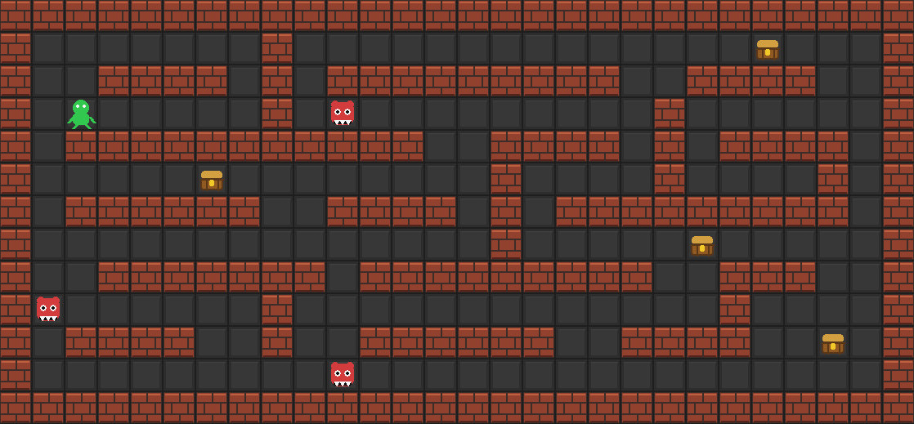

# Treasure Dash

A simple graphical Python game built with the `pygame` library.

The player controls a green circle, moves around the map, avoids walls and enemies, and must collect every treasure.



## Features

* Graphical window powered by `pygame`
* Real-time keyboard controls
* Walls and obstacles
* Multiple treasures to collect
* Moving enemies that end the game on contact
* Cross-platform support (Linux, macOS, Windows)

## Requirements

To run the game, you need:

* Python 3.10 or newer
* Git
* pip
* venv
* make (optional, but recommended)

## Installation on Debian / Ubuntu

Install the required packages:

```bash
sudo apt update
sudo apt install python3 python3-venv python3-pip git make
```

Check the versions:

```bash
python3 --version
git --version
make --version
```

## Getting the Source Code

Clone the repository:

```bash
git clone https://github.com/reznikvas/Treasure-Dash.git
cd Treasure-Dash
```

## Installing Dependencies

### Option 1. Recommended (using Makefile)

Create a virtual environment and install dependencies:

```bash
make install
```

### Option 2. Manual Installation

Create a virtual environment:

```bash
python3 -m venv .venv
```

Activate it:

```bash
source .venv/bin/activate
```

Upgrade pip:

```bash
pip install --upgrade pip
```

Install dependencies:

```bash
pip install -r requirements.txt
```

## Running the Game

### Using Makefile

```bash
make run
```

### Manually

```bash
source .venv/bin/activate
python treasure_dash.py
```

## Controls

| Key     | Action          |
| ------- | --------------- |
| W       | Move up         |
| S       | Move down       |
| A       | Move left       |
| D       | Move right      |
| ↑       | Move up         |
| ↓       | Move down       |
| ←       | Move left       |
| →       | Move right      |
| ESC     | Exit the game   |

## Project Structure

```text
Treasure-Dash/
├── treasure_dash.py
├── requirements.txt
├── Makefile
├── treasure-dash.jpg
├── .gitignore
└── README.md
```

## Useful Commands

Install dependencies:

```bash
make install
```

Run the game:

```bash
make run
```

Remove the virtual environment:

```bash
make clean
```

## Troubleshooting

### "externally-managed-environment" Error

On Debian 12/13, installing Python libraries into the system Python with a regular `pip install` is not allowed.

Use a virtual environment:

```bash
python3 -m venv .venv
source .venv/bin/activate
pip install -r requirements.txt
```

### "No module named pygame" Error

Dependencies are not installed.

Run:

```bash
make install
```

or

```bash
source .venv/bin/activate
pip install -r requirements.txt
```

### The Game Window Does Not Open

Make sure that:

* you are using a graphical Linux, Windows, or macOS session;
* the game is not running over SSH without graphics forwarding;
* the `pygame` library is installed correctly.

## For Developers

After making code changes:

```bash
make run
```

or

```bash
source .venv/bin/activate
python treasure_dash.py
```

The main game code is located in:

```text
treasure_dash.py
```
## License

This project is licensed under the GNU General Public License v3.0 (GPLv3).

See the LICENSE file for details.
